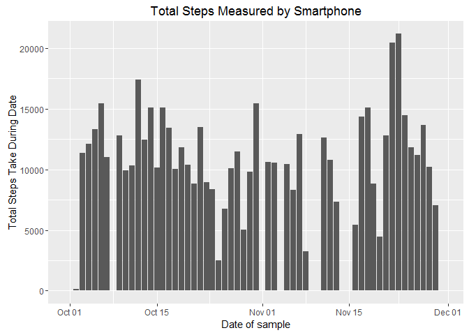
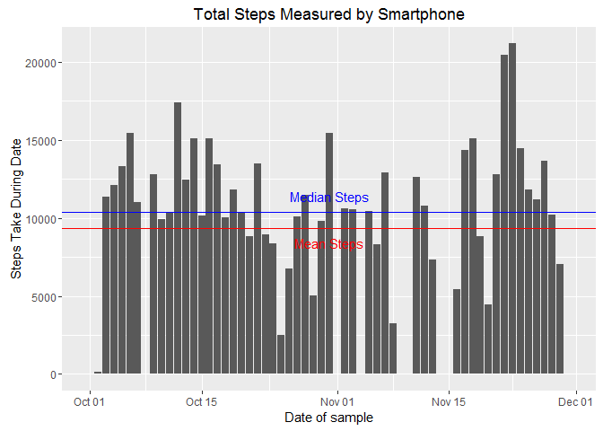
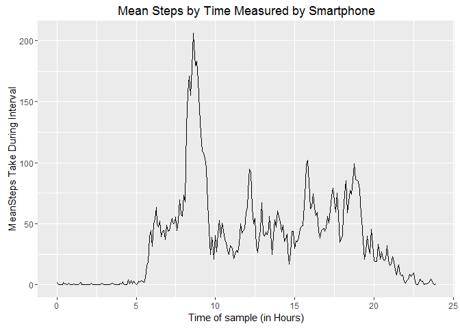
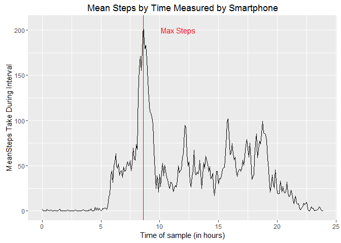
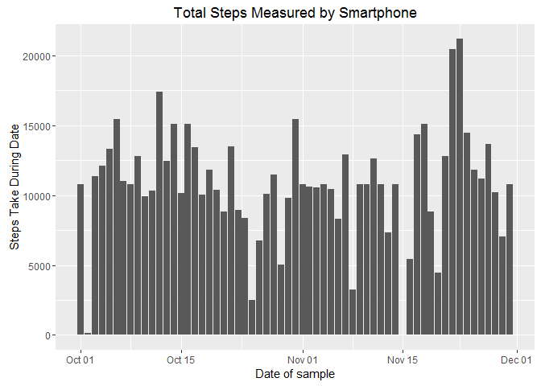
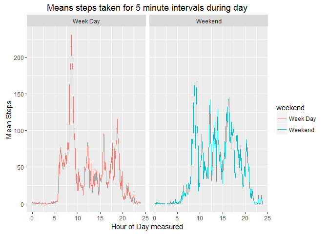

# Reproducible Research Assignment: Course Project 1
Mark Davey  
July 16, 2016  


#Course Project 1
## Data

Data from a personal activity monitoring device. This device collects data at 5 minute intervals through out the day. The data consists of two months of data from an anonymous individual collected during the months of October and November, 2012 and include the number of steps taken in 5 minute intervals each day. (Source Courser Web Site)

##Data Source
The data for this assignment can be downloaded from the course web site:

Dataset: [Activity monitoring data]( https://d396qusza40orc.cloudfront.net/repdata%2Fdata%2Factivity.zip)

###The variables included in this dataset are:

* steps: Number of steps taking in a 5-minute interval (missing values are coded as NA)
* date: The date on which the measurement was taken in YYYY-MM-DD format
* interval: Identifier for the 5-minute interval in which measurement was taken

The dataset is stored in a comma-separated-value (CSV) file and there are a total of 17,568 observations in this dataset.

##Process the data

###First cleanup and load the librarys
Remove old variables and include packages used in analysis

```r
#clean up
#setwd("C:/Users/mdavey/Google Drive/Data Science/reproducable research/Week 2")
rm(list=ls())
#
#
library(lubridate)
#library(data.table)
library(dplyr)
library(sqldf)
library(ggplot2)
library(reshape2)
```

###Download the data and read it into the R system
Check if the files exist and download it (if not, unpack), then read it in to memory

```r
#get the data from the remote system and unpack it only if does not exist
if (!file.exists("data")) {
  dir.create("data")
}
if (!file.exists("./data/activity.csv")) {
  fileURL <- "https://d396qusza40orc.cloudfront.net/repdata%2Fdata%2Factivity.zip"
  download.file(fileURL,destfile = "./data/Activity.zip",method="libcurl")
}
#?
if (!file.exists("./data/activity.csv")) {
  unzip("./data/Activity.zip",exdir = "./data")
}
#
#read 
activity <- read.csv("./data/activity.csv")
```

###Histogram of the total number of steps taken each day
R code to great a histgram of average steps
[Per GGPLOT Documentation The bar geom is used to produce 1d area plots: bar charts for categorical x, and histograms for continuous y. stat_bin explains the details of these summaries in more detail.](http://docs.ggplot2.org/0.9.3.1/geom_bar.html)
[Stackover flow explaining geom_bar is what should be used to plot histograms in ggplot](http://stackoverflow.com/questions/14138247/ggplot-geom-bar-vs-geom-histogram)
Note: Total steps taken each day that is sum of steps by each day as below.
<!-- -->


###Calculate and plot Mean and median number of steps taken each day
Calculate and plot the averages Per below mean is 9354.23 and median is 10395.

```r
#Mean and median number of steps taken each day
activity.daily.mean.steps <- mean(as.numeric(activity.daily.steps$total.steps),na.rm=TRUE)
print(activity.daily.mean.steps)
```

```
## [1] 9354.23
```

```r
activity.daily.median.steps <- median(as.numeric(activity.daily.steps$total.steps),na.rm=TRUE)
print(activity.daily.median.steps)
```

```
## [1] 10395
```

```r
plotted <- ggplot(data=activity.daily.steps,aes(x=date,y=total.steps))+geom_bar(stat="identity") +
geom_hline(yintercept = activity.daily.mean.steps,color=c("red")) +
annotate("text", x=mean(activity$date), y=(activity.daily.mean.steps*0.9), 
         label = "Mean Steps",color=c("red")) +
geom_hline(yintercept = activity.daily.median.steps,color=c("blue")) +
annotate("text", x=mean(activity$date), y=(activity.daily.median.steps*1.1), 
         label = "Median Steps",color=c("blue")) +
   labs(x="Date of sample",y="Steps Take During Date",title="Total Steps Measured by Smartphone")
plotted
```

<!-- -->

###Time series plot of the average number of steps taken
The graph below is a line plot of the mean by the date.

```r
activity.time  <- activity %>% group_by(interval) %>% summarize(mean_steps=mean(steps,na.rm=TRUE))
activity.time$timereal  <- activity.time$interval%/%100 + activity.time$interval%%100/60 
plotted <- ggplot(data=activity.time,aes(x=timereal,y=mean_steps))+geom_line() +
   labs(x="Time of sample (in Hours)",y="MeanSteps Take During Interval",title="Mean Steps by Time Measured by Smartphone")
plotted
```

<!-- -->


###The 5-minute interval that, on average, contains the maximum number of steps
Sort the averages by means and then take the top value. This was at 8:35AM and was 206.2.

```r
max.average.step.time <- head(activity.time[order(activity.time$mean_steps,decreasing = TRUE),],1)
print(max.average.step.time)
```

```
## # A tibble: 1 x 3
##   interval mean_steps timereal
##      <int>      <dbl>    <dbl>
## 1      835   206.1698 8.583333
```

```r
plotted <- ggplot(data=activity.time,aes(x=timereal,y=mean_steps)) + geom_line(stat="identity")+
geom_vline(aes(xintercept=as.numeric(max.average.step.time$timereal)), color="red", na.rm=TRUE) +
annotate("text", x=max.average.step.time$timereal+3, y=200, 
         label = "Max Steps",color=c("red")) +
  labs(x="Time of sample (in hours)",y="MeanSteps Take During Interval",
       title="Mean Steps by Time Measured by Smartphone")
plotted
```

<!-- -->

###Code to describe and show a strategy for imputing missing data
I've imputted the missing values using the mean by interval for that interval. The code below shows the original column steps has 2304 NA while the stepsfixed have none. 

  * Calculate the averages over each interval
  * Merge those averages with the original data
  * Apply a merge with a condition to apply a new column the mean if the original value was NA otherwise keep the original value
  * Check the new column has no N/A and the head to confirm correct replacement of only NA's
  

```r
activity.time  <- activity %>% group_by(interval) %>% summarize(mean_steps=mean(steps,na.rm=TRUE))
fixed_dataset <- merge(activity,activity.time,by="interval",all=TRUE)
fixed_dataset <- mutate(fixed_dataset, stepsfixed=ifelse(is.na(steps)==TRUE,mean_steps,steps))
sum(is.na(fixed_dataset$steps))
```

```
## [1] 2304
```

```r
sum(is.na(fixed_dataset$stepsfixed))
```

```
## [1] 0
```

```r
head(fixed_dataset)
```

```
##   interval steps       date mean_steps stepsfixed
## 1        0    NA 2012-10-01   1.716981   1.716981
## 2        0     0 2012-11-23   1.716981   0.000000
## 3        0     0 2012-10-28   1.716981   0.000000
## 4        0     0 2012-11-06   1.716981   0.000000
## 5        0     0 2012-11-24   1.716981   0.000000
## 6        0     0 2012-11-15   1.716981   0.000000
```


###Histogram of the total number of steps taken each day after missing values are imputed

Plotted cleaned up value using new stepsfixed column.


```r
#Histogram of the total number of steps taken each day
activity.daily.stepsfixed  <- fixed_dataset %>% group_by(date) %>% summarize(total.steps=sum(stepsfixed,na.rm=TRUE))
plotted <- ggplot(data=activity.daily.stepsfixed,aes(x=date,y=total.steps))+geom_bar(stat="identity") 
plotted <-plotted + labs(x="Date of sample",y="Steps Take During Date",title="Total Steps Measured by Smartphone")
plotted
```

<!-- -->

###Panel plot comparing the average number of steps taken per 5-minute interval across weekdays and weekends

```r
fixed_dataset$datetime <- ymd(fixed_dataset$date)+hours(fixed_dataset$interval%/%100)+minutes(fixed_dataset$interval%%100)
fixed_dataset$weekend <- ifelse(wday(fixed_dataset$datetime) %in% c(1,7),"Weekend","Week Day")
fixed.dataset.time  <-  fixed_dataset %>% subset(select=c("interval","weekend","stepsfixed"))  %>%group_by(interval,weekend) %>% summarize(mean_steps=mean(stepsfixed,na.rm=TRUE))
fixed.dataset.time$timereal  <- fixed.dataset.time$interval%/%100 + fixed.dataset.time$interval%%100/60 
plotted <- ggplot(data= fixed.dataset.time,aes(x=timereal,y=mean_steps,group=weekend,color=weekend))+
facet_grid(.~weekend)+  geom_line()+
labs(x="Hour of Day measured",y="Mean Steps",title="Means steps taken for 5 minute intervals during day")
plotted
```

<!-- -->

###All of the R code needed to reproduce the results (numbers, plots, etc.) in the report
Is included in above report.
